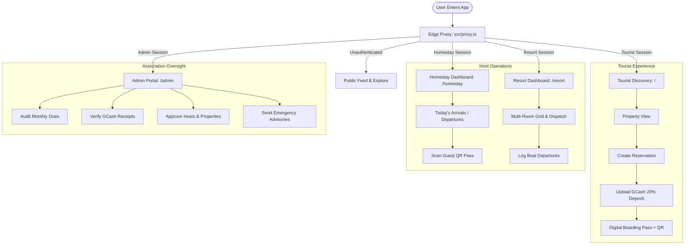

# MVBA — San Agustin Resort & Homestay Association Web App
> **Living Project Documentation & Architecture Blueprint**  
> *Last Updated: September 2026*

---

## 1. Executive Summary & Vision

**MVBA** (San Agustin Resort & Homestay Association) is a Progressive Web Application (PWA) tailored for the eco-tourism ecosystem of **Bretania, San Agustin, Surigao del Sur, Philippines** (famed for the 24-island Bretania archipelago in Lianga Bay).

The platform serves as the single digital operating system for municipal tourism, connecting four key stakeholders:
1. **Tourists (Guests)**: Seamlessly discover verified local accommodations, book rooms, calculate regulated island-hopping boat tariffs, pay downpayments via GCash, access digital boarding passes with QR codes, and chat in realtime with hosts.
2. **Homestay Hosts**: Manage room allocations, daily arrivals/departures, accept/decline booking requests, scan guest check-in QR codes, track association dues, and message guests or association leadership.
3. **Resort Operators**: Comprehensive hospitality dashboard with multi-room availability calendars, analytics, addon services (boat rental, dining, spa), boat dispatch manifests, and guest reviews.
4. **Association Administrators (MVBA Leadership & Municipal Tourism Office)**: Oversee municipal tourist capacity, approve new host accounts and property listings, audit association dues, verify GCash deposits, track 8% association commissions, disburse host payouts, and broadcast emergency advisories.

---

## 2. Technology Stack

| Layer | Technology | Description |
| :--- | :--- | :--- |
| **Framework** | Next.js 16 (App Router) | React 19, Server Components, Server Actions, Route Handlers |
| **Language** | TypeScript 5 (Strict) | End-to-end type safety with database mirror types |
| **Styling & UI** | Tailwind CSS v4, shadcn/ui, Radix UI | Responsive, mobile-first design system with rich tactile UX |
| **Animation** | Framer Motion & tw-animate-css | Micro-interactions, smooth drawers, modals, transitions |
| **Icons** | Lucide React | Consistent SVG iconography throughout dashboards |
| **Database & Auth** | Supabase (PostgreSQL 15+) | SSR cookie session auth, Row Level Security (RLS), Realtime WebSockets |
| **Edge Security** | Zero-Trust Proxy (`src/proxy.ts`) | Edge role resolution, route isolation, non-blocking prefetch handling |
| **PWA & Offline** | Serwist (`@serwist/next`) | Service worker caching, offline capability, installable manifest |
| **Push Notifications**| OneSignal SDK & REST API | Web push notifications for instant booking updates & messages |
| **Hosting & CI/CD** | Vercel & GitHub Actions | Automated typecheck, linting, and automated Supabase keep-alive cron |

---

## 3. Architecture & Project Structure

```
MVBA-webapp/
├── .github/
│   └── workflows/
│       ├── production.yml          # CI QA: npm ci, tsc --noEmit, eslint
│       └── supabase-keep-alive.yml # Scheduled cron ping to prevent project pausing
├── public/
│   ├── icons/                      # PWA icons (192px, 512px)
│   ├── manifest.json               # Web App Manifest (standalone PWA display)
│   └── OneSignalSDKWorker.js       # Push notification service worker
├── scripts/
│   └── keep-alive.mjs              # Node utility for database keep-alive pings
├── src/
│   ├── app/
│   │   ├── (dashboard)/            # Authenticated Role Portals
│   │   │   ├── admin/              # Municipal & Association Admin Dashboard
│   │   │   │   ├── announcements/  # Association bulletin broadcast
│   │   │   │   ├── chat/           # Central association messaging channel
│   │   │   │   ├── dues/           # Association dues audit & collection
│   │   │   │   ├── properties/     # Property vetting & approval queue
│   │   │   │   ├── transactions/   # Deposit verification & payout ledger
│   │   │   │   ├── users/          # Host account creation & approval
│   │   │   │   ├── layout.tsx      # Admin dashboard layout with sidebar
│   │   │   │   └── page.tsx        # High-level KPIs & executive metrics
│   │   │   ├── homestay/           # Homestay Operator Dashboard
│   │   │   │   ├── bookings/       # Booking approval workflow
│   │   │   │   ├── chat/           # Guest & admin communications
│   │   │   │   ├── dispatch/       # Island-hopping boat dispatch log
│   │   │   │   ├── profile/        # Homestay details & policies
│   │   │   │   ├── reviews/        # Guest feedback & ratings
│   │   │   │   ├── rooms/          # Room pricing & capacity
│   │   │   │   ├── services/       # Extra amenities & offerings
│   │   │   │   ├── layout.tsx      # Host sidebar & top navigation
│   │   │   │   └── page.tsx        # "Today" arrival/departure operational view
│   │   │   └── resort/             # Resort Operator Dashboard
│   │   │       ├── bookings/       # Guest reservation ledger
│   │   │       ├── calendar/       # Multi-room visual availability grid
│   │   │       ├── chat/           # Realtime chat
│   │   │       ├── dispatch/       # Vessel management & boat dispatch
│   │   │       ├── profile/        # Resort amenities, photos, policies
│   │   │       ├── reviews/        # Review management
│   │   │       ├── rooms/          # Room inventory & rates
│   │   │       ├── services/       # Addon services (island tours, dining)
│   │   │       ├── layout.tsx      # Resort layout & sidebar
│   │   │       └── page.tsx        # Revenue & occupancy analytics
│   │   ├── (tourist)/              # Tourist Discovery & Guest Experience
│   │   │   ├── bookings/           # Tourist reservation history & active passes
│   │   │   ├── chat/               # Live chat with hosts
│   │   │   ├── explore/            # Bretania 24 Islands travel guide & tips
│   │   │   ├── profile/            # User account settings & sign out
│   │   │   ├── property/[id]/      # Property & room booking page
│   │   │   ├── wishlist/           # Saved favorites
│   │   │   ├── layout.tsx          # Tourist wrapper
│   │   │   └── page.tsx            # Discovery marketplace homepage
│   │   ├── actions/                # Server Actions (Mutations & Atomic DB calls)
│   │   │   ├── admin-actions.ts    # Secure owner creation via Service Role
│   │   │   ├── admin-transactions.ts # GCash deposit verification & payout status
│   │   │   └── booking-actions.ts  # Server-side pricing calculation & atomic booking
│   │   ├── api/                    # API Route Handlers
│   │   │   ├── health/             # Health check endpoint
│   │   │   ├── keep-alive/         # Database keep-alive trigger
│   │   │   ├── notify/             # OneSignal server push dispatch
│   │   │   └── revalidate/         # On-demand ISR revalidation
│   │   ├── globals.css             # Tailwind v4 theme & CSS custom properties
│   │   ├── layout.tsx              # Root application layout with fonts & metadata
│   │   ├── proxy.ts                # Next.js Edge proxy middleware
│   │   └── sw.ts                   # Serwist Service Worker definition
│   ├── components/
│   │   ├── admin/                  # Admin UI components (e.g., AddUserModal)
│   │   ├── auth/                   # Authentication modals (Login/Register)
│   │   ├── layouts/                # Role sidebars, Topbar, Tourist bottom navigation
│   │   ├── owner/                  # Host components (RoomForm, QRScanner, DuesModal, etc.)
│   │   ├── shared/                 # Chat system, Logo, Weather alerts, Dev role switcher
│   │   ├── tourist/                # Discovery feed, Booking modals, Boarding pass, Cards
│   │   └── ui/                     # Base shadcn primitives (button, badge, dialog, etc.)
│   ├── hooks/                      # Custom React hooks
│   │   ├── use-auth.ts             # Auth session & profile listener
│   │   ├── use-realtime-messages.ts# WebSocket chat subscriptions
│   │   └── use-wishlist.ts         # LocalStorage wishlist with custom event dispatch
│   └── lib/
│       ├── constants.ts            # Roles, routes, navigation menus, status colors
│       ├── utils.ts                # Tailwind merge and utility helpers
│       ├── data/                   # Static discovery & seed fallback data
│       ├── supabase/               # Supabase client configurations
│       │   ├── admin.ts            # Service role client (bypasses RLS for secure actions)
│       │   ├── client.ts           # Browser client for client-side queries
│       │   ├── proxy.ts            # Cookie & session handler for Edge proxy
│       │   ├── server.ts           # Server component / server action client
│       │   └── storage.ts          # Storage upload & bucket management
│       └── types/
│           └── database.ts         # TypeScript schema mirroring PostgreSQL tables
├── supabase/
│   ├── schema.sql                  # Canonical full database schema, RLS, functions
│   ├── concurrency_booking_fix.sql # Atomic booking function & concurrency indexes
│   ├── keep_alive.sql              # Supabase pg_cron keep-alive routine
│   └── migrations/                 # Incremental SQL migration patches
│       ├── onesignal-id.sql
│       ├── tenant-isolation.sql
│       └── security-hardening.sql  # Zero-Trust RLS, triggers & privilege protection
├── AGENTS.md                       # Next.js 16 architectural notice
├── Project.md                      # Primary project documentation (this document)
└── next.config.ts                  # Enterprise CDN image caching & Next.js config
```

---

## 4. User Roles & Core Workflows



### 4.1 Tourist (Guest)
- **Discovery**: Filter properties by category (Beachfront, Island Hopping, Budget, Family, Luxury) or search by keywords.
- **Booking Engine**:
  - Validates date ranges and capacity.
  - Server-calculated pricing (Base Rate × Nights + Addons).
  - Calculates 20% mandatory downpayment and 8% association fee.
  - Prevents double-booking via PostgreSQL atomic transaction lock.
- **Deposit & Boarding Pass**:
  - Tourist uploads GCash reference number and receipt screenshot.
  - Generates an official `MVBA-BRIT-XXXX` Digital Boarding Pass with dynamic QR code for host check-in.
- **Realtime Chat**: Direct two-way messaging with property hosts.

### 4.2 Homestay Host
- **Daily Operations ("Today")**: Immediate view of checking-in, in-house, and checking-out guests.
- **QR Check-in Scanner**: Camera or manual reference input to verify guest boarding passes instantly.
- **Room Management**: Edit descriptions, maximum capacity, base pricing, and active status.
- **Association Dues**: Review monthly dues status, send GCash payments directly to the MVBA Municipal Treasury, and upload proof of payment.

### 4.3 Resort Operator
- **Analytics**: Key performance metrics (Occupancy rate, gross bookings, net payouts).
- **Interactive Calendar**: Visual date-grid showing room availability and existing bookings.
- **Addon Services**: Configure custom extras (catering, private island tours, spa).
- **Boat Dispatch Management**: Track passenger manifests, vessel names, captains, and departure/return statuses adhering to maritime tourism standards.
- **Boat Rate Calculator**: Standard Bretania 4-Island Circuit tariff computation (Base tariff, passenger tiers, environmental fees).

### 4.4 Association Administrator (MVBA Leadership)
- **Municipal Oversight**: Monitor tourist flow across all San Agustin / Bretania accommodations.
- **Vetting & Approvals**: Review new property listings and host registrations before they appear in public search.
- **Financial Clearinghouse**:
  - Verify guest GCash downpayments.
  - Track the 8% municipal/association commission fee.
  - Mark host payouts as `paid` once disbursed.
- **Dues Collection**: Audit host compliance with monthly association membership dues.
- **Announcements**: Publish urgent weather advisories (gale warnings, Coast Guard cancellations) and association circulars.

---

## 5. Database Schema & Data Integrity

### Core Tables
1. **`profiles`**: Tied 1:1 to `auth.users`. Stores role (`admin`, `homestay`, `resort`, `tourist`), full name, phone number, avatar, approval status, and OneSignal push subscription ID.
2. **`properties`**: Physical accommodation metadata, owner reference, cover photo, policies, check-in/out times, and operational status (`active`, `renovating`, `full`, `closed`).
3. **`rooms`**: Individual rooms/units under a property, with base price, capacity, and activation flag.
4. **`room_images`**: Photo gallery for individual rooms with display ordering.
5. **`bookings`**: Central transaction entity containing date ranges, guest count, financial breakdown (`total_price`, `downpayment_amount`, `commission_amount`, `host_payout_amount`), payment statuses (`awaiting_deposit`, `deposit_uploaded`, `verified`, `completed`, `refunded`), and QR pass data.
6. **`extra_services`**: Optional add-on amenities offered by properties.
7. **`booking_addons`**: Many-to-many relationship linking extra services to a specific booking.
8. **`boat_dispatches`**: Vessel dispatch logs for maritime regulation compliance.
9. **`reviews`**: Verified tourist reviews and ratings (1-5 stars).
10. **`association_dues`**: Monthly dues tracker per host with receipt upload and treasury reconciliation.
11. **`announcements`**: Admin broadcasts targeted to all or specific operator roles.
12. **`messages`**: Realtime chat messages between tourists, hosts, and admin.

### High-Concurrency Double-Booking Prevention
The system implements `request_booking_atomic` in PostgreSQL (`supabase/concurrency_booking_fix.sql`):
- Acquires a row-level lock (`FOR UPDATE`) on the requested room.
- Evaluates overlap with the interval formula: `(check_in_date < p_check_out) AND (check_out_date > p_check_in)`.
- Rejects overlapping reservations with error code `DATE_CONFLICT` before committing.

---

## 6. Security & Edge Routing Blueprint

1. **Zero-Trust Edge Proxy (`src/proxy.ts`)**:
   - Intercepts all requests before Next.js page hydration.
   - Refreshes Supabase session tokens securely via cookies.
   - Restricts role escalation: Authenticated user roles are derived strictly from database records (`profiles.role`) or server-managed JWT claims (`app_metadata.role`). Client-writable `user_metadata` is explicitly excluded from role authorization decisions.
   - Sets the `mvba_user_role` cookie with `httpOnly: true` and `secure: true` to prevent client-side script inspection and spoofing.
   - Automatically redirects hosts visiting the public tourist root `/` directly to their respective dashboards.
   - Ignores prefetch requests to prevent session cache poisoning.
2. **Server Action & API Authorization**:
   - Every administrative Server Action (`createOwnerAccount`, `verifyDepositAction`, `markPayoutPaidAction`) performs server-side caller authentication and verifies that `profiles.role === 'admin' && profiles.is_approved === true`.
   - The `/api/notify` route enforces strict `INTERNAL_API_SECRET` token validation or authenticated user session, eliminating unauthorized notification relays.
   - The `/api/revalidate` cache purge endpoint enforces `REVALIDATION_SECRET` and fails closed without hardcoded fallback keys.
3. **Row Level Security (RLS) & Database Triggers (`supabase/migrations/security-hardening.sql`)**:
   - Enabled across all Supabase tables.
   - **Signup Lock**: `handle_new_user()` trigger unconditionally assigns `role = 'tourist'` and `is_approved = true`, preventing attackers from supplying `role: 'admin'` in signup payloads.
   - **Tamper-Proof Profiles**: `BEFORE UPDATE` trigger on `profiles` blocks modifications to `role` or `is_approved` unless initiated by an approved admin or service role.
   - **Cancellation-Only Tourist RLS**: Tourists can only update their own bookings to `status = 'cancelled'`. All price calculations, deposit verifications, and approvals are isolated to server actions.
   - **Treasury Isolation**: Hosts can upload dues payment receipts but cannot mark dues as `paid`. Only administrators can settle dues.
   - **Receipt Access**: Property hosts can view GCash receipts submitted for bookings on their properties.
4. **Storage & Media Isolation**:
   - Private buckets (such as `payment-receipts`) generate short-lived signed URLs via `createSignedUrl` rather than broken or insecure public URLs.

---

## 7. Feature Branch & Release Protocol

> [!IMPORTANT]
> **Every feature or architectural change must update this `Project.md` file before pushing to a feature branch.**

### Database Migration Notice for Project Leader
When merging `feat/security-hardening` to `main`, the project leader must execute the following file in the Supabase SQL Editor:
- **`supabase/migrations/security-hardening.sql`**

### Pre-Push Verification Checklist
When preparing a branch to push (`feat/*`, `fix/*`, `refactor/*`):
1. [ ] **TypeScript Check**: Execute `npx tsc --noEmit` to ensure 0 type errors.
2. [ ] **ESLint Verification**: Run `npm run lint` and resolve any warnings or deprecations.
3. [ ] **Database Alignment**: Ensure all new columns or tables are reflected in `src/lib/types/database.ts` and `supabase/schema.sql`.
4. [ ] **Security Review**: Check that all new routes are appropriately protected in `src/proxy.ts` and RLS policies exist.
5. [ ] **Update `Project.md`**:
   - Document any new components, routes, or server actions.
   - Update the Changelog section below.
   - Verify that directory trees and role flows remain accurate.

---

## 8. Living Changelog & Feature Tracker

### [v0.1.1] - Security Hardening & Zero-Trust Authorization (Branch: `feat/security-hardening`)
- **Server Action Authorization**: Added mandatory session authentication and admin role verification to `createOwnerAccount`, `verifyDepositAction`, and `markPayoutPaidAction`.
- **Edge Proxy Hardening (`src/proxy.ts`)**: Removed reliance on client-writable `user_metadata` for authorization. Hardened `mvba_user_role` cookie with `httpOnly: true`. Enforced operator approval verification.
- **Client Auth Fallback (`auth-modal.tsx`)**: Replaced default fallback role of `"admin"` with safe least-privilege `"tourist"` and home route `"/"`.
- **API Route Lockdown**:
  - `/api/notify`: Enforced strict `INTERNAL_API_SECRET` or authenticated session validation (returns 401 on unauthorized).
  - `/api/revalidate`: Removed hardcoded secret fallback (`sarah-pwa-revalidate-key`); requires configured `REVALIDATION_SECRET`.
- **Storage Helper (`src/lib/supabase/storage.ts`)**: Added support for private buckets and secure signed URL generation (`createSignedUrl`).
- **Database Migration (`supabase/migrations/security-hardening.sql`)**: Created comprehensive SQL script for project leader enforcing signup role restriction, profile role tamper prevention trigger, strict booking cancellation policy, and host receipt viewing permissions.
- **CI Pipeline & TypeScript Alignment**:
  - Fixed missing `GCashDepositModal` export in `gcash-deposit-modal.tsx`.
  - Added `Relationships: []` and full schema fields (`onesignal_id`, `downpayment_amount`, etc.) to `src/lib/types/database.ts` to restore Supabase generic type safety.
  - Aligned OneSignal push initialization and Calendar `DateRange` typing.
  - Resolved JSX unescaped entities in `property-client.tsx` and `property-reviews-manager.tsx`.
  - Configured `eslint.config.mjs` to ignore scratch scripts and warn on explicit `any`.
  - Both `npx tsc --noEmit` and `npm run lint` now pass cleanly with 0 errors.
- **Main Branch Sync & Merge Validation**:
  - Synced and merged 7 latest commits from `origin/main` (`d76f662..42c9f55`), bringing in the new Britania PWA branding, updated Apple touch icon, and `PushInitializer` root layout integration.
  - Successfully resolved merge conflicts in `PushInitializer.tsx`, `booking-request-modal.tsx`, `use-realtime-messages.ts`, and `gcash-deposit-modal.tsx`.
  - Removed duplicate and deprecated modal declarations in `gcash-deposit-modal.tsx` while preserving standard upload interface and backwards-compatible `ReceiptUploadDialog` export.
  - Verified full test suite: `npx tsc --noEmit` (0 errors), `npm run lint` (0 errors), and full production build `npm run build` (36/36 static and dynamic routes compiled cleanly in Next.js 16 Turbopack).
- **Git Hygiene**: Added `scratch*`, `debug*`, and `*.log` to `.gitignore` and untracked all test scripts with plaintext credentials from git tracking.

### [v0.1.0] - Foundation & Core Architecture (September 2026)
- **Initial Setup**: Next.js 16 App Router, React 19, Tailwind CSS v4, Lucide icons.
- **Portals**:
  - Tourist marketplace with category filters, search, and property detail pages.
  - Homestay dashboard with today's arrivals/departures and dues payment modal.
  - Resort dashboard with room management, dispatch logger, and boat rate calculator.
  - Admin association portal with dues audit, user management, and transaction ledger.
- **Realtime & Communications**:
  - WebSocket-powered chat system across all roles.
  - OneSignal Web Push notifications integration (`/api/notify`).
- **PWA & Offline**:
  - Serwist service worker configured with network-first and asset caching strategies.
  - Responsive layout with bottom navigation for mobile tourists and sidebars for desktop hosts.
- **Database & Concurrency**:
  - Complete PostgreSQL schema with RLS policies and `request_booking_atomic` stored procedure.
  - Server actions for secure reservations and GCash payment approvals.
